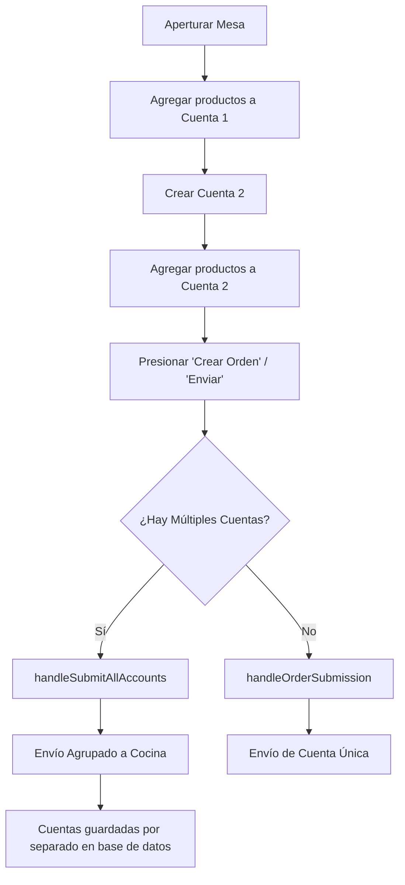

# Flujo de Trabajo Multicuenta (Multi-Account) - Las Palmas POS

Este documento detalla el funcionamiento lógico y operativo del flujo multicuenta dentro de la mesa. Ha sido diseñado para evitar inconsistencias de datos, optimizar la coordinación con cocina y garantizar la separación de comandas por comensal.

---

## 📋 Resumen del Flujo de Trabajo

El sistema permite comandar de forma independiente para diferentes cuentas asociadas a una misma mesa y enviar todas las cuentas pendientes a cocina en un solo lote agrupado.

---

## 🚀 Paso a Paso Operativo (Meseros)

1. **Aperturar la Mesa:**
   * El mesero abre la mesa seleccionada. Por defecto, se crea y selecciona la **Cuenta 1**.
2. **Tomar el primer pedido (Cuenta 1):**
   * Se agregan los platos al panel lateral. Estos productos se mantienen en **estado local/temporal** (no se envían a cocina inmediatamente) y quedan arraigados al identificador de la Cuenta 1.
3. **Crear nuevas cuentas:**
   * El mesero pulsa en el modal de cuentas para agregar una nueva cuenta (ej: **Cuenta 2**).
   * Al hacer esto, los productos de la Cuenta 1 permanecen a salvo en su propia vista y el mesero puede comenzar a agregar productos nuevos en la pestaña de la Cuenta 2.
4. **Visualización de Totales Reales:**
   * Al abrir el modal **Cuentas**, el sistema muestra un resumen exacto con los subtotales de cada cuenta, **incluyendo los productos temporales (locales) recién comandados** junto a los consumos que ya se hubieran enviado previamente.
5. **Envío Masivo ("Crear Orden" / "Confirmar"):**
   * Una vez completadas todas las cuentas con sus respectivos productos locales, el mesero presiona el botón principal **"Crear Orden"**.
   * El sistema detecta automáticamente que hay múltiples cuentas con productos pendientes y ejecuta un **envío agrupado de todas las cuentas simultáneamente**.
   * Cada cuenta se registra por separado en la base de datos Supabase con su propio `order_id` y su propia comanda para cocina, pero todas se procesan con un solo clic.

---

## 🛠️ Especificación Técnica e Integridad de Datos

### 1. Arraigo Estricto de Productos (`order_id`)
Para prevenir la "contaminación cruzada" de productos entre cuentas (donde los platos de una cuenta se movían accidentalmente a otra al cambiar de pestaña), la función `handleOrderSubmission` y la lógica interna realizan una asignación forzada del `activeOrderId` al crear o cambiar de cuenta. 
* Los productos sin `order_id` en el estado local se filtran de forma estricta para que pertenezcan únicamente al `activeOrderId` seleccionado.

### 2. Envío Agrupado (`handleSubmitAllAccounts`)
Cuando existen múltiples cuentas con productos pendientes de enviar (`!is_sent`), el botón principal ejecuta el método unificado:
* Agrupa todos los ítems locales según su `order_id` asignado.
* Envía cada grupo mediante una llamada RPC (`submit_order_items`) específica para cada orden en Supabase.
* En caso de fallo o desconexión, realiza un fallback seguro de inserción directa a la tabla `order_items`.
* Si ocurre un error de red, los cambios se revierten optimistamente para no marcar productos como enviados si cocina no los ha recibido.

### 3. Anulación Masiva Unificada
El botón **"Anular Orden"** situado en la vista de la mesa realiza una cancelación en lote:
* Recupera todas las órdenes activas de la mesa (`tableOrders`).
* Ejecuta en un bucle orden por orden la cancelación mediante el RPC seguro `cancel_order_with_pin`, validando el PIN administrativo una sola vez.
* Libera la mesa (`available`) de forma automática al finalizar el proceso.
