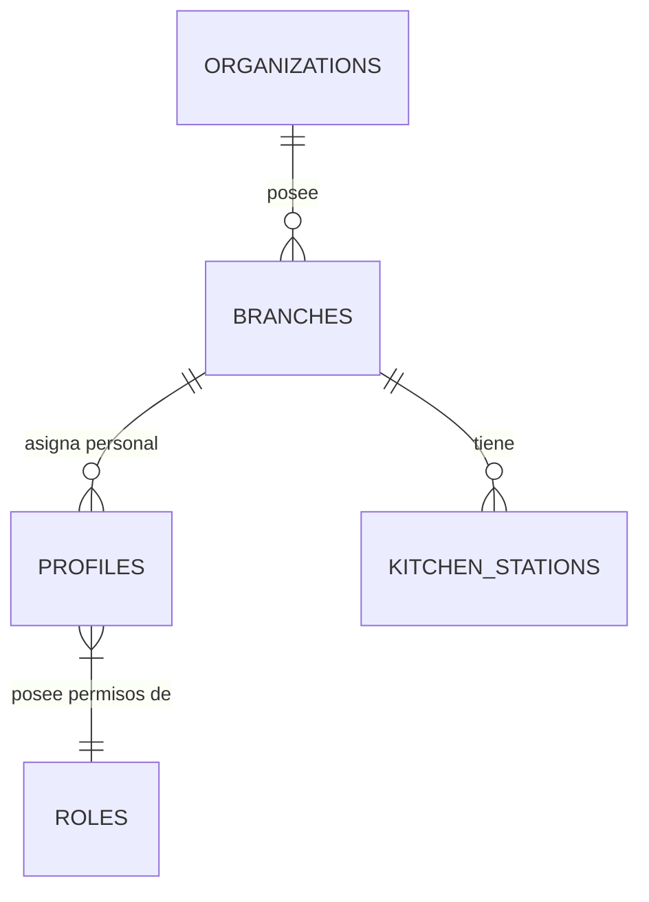

# Módulo: Configuración Global

## Descripción general
Este módulo centraliza los parámetros maestros del sistema. Su propósito es definir el comportamiento global de la aplicación, desde la identidad del restaurante y sucursales hasta los protocolos de seguridad, acceso de usuarios y configuración de hardware (impresoras y terminales).

## Categorías
1. **Perfil del Restaurante**: Datos fiscales, logotipos y configuración de moneda.
2. **Sucursales**: Multisitio: nombres, direcciones y terminales asignadas.
3. **Usuarios y Seguridad**: Gestión de roles, perfiles de acceso y políticas RLS.
4. **Hardware y Periféricos**: Configuración de impresoras de tickets (térmicas) y envío de correos (SMTP).
5. **Estaciones de Preparación**: Definición de destinos para comandas (ej. Cocina 1, Barra Fría).

## Interacción con Base de Datos

### Estructura de Tablas (DDL)

#### 1. `system_settings` (Configuración Maestra)
Tabla de fila única (`id=1`) que controla el comportamiento global.
- `restaurant_name`: `TEXT`.
- `tax_percentage`: `DECIMAL(5,2)` - % IVA (ej. 12.00).
- `enable_billing`: `BOOLEAN` - Activa integración FEL.
- `ws_key` / `signer_token`: Credenciales encriptadas para acceso a API SAT.
- `require_pin_for_register`: `BOOLEAN` - Fuerza seguridad en POS.

#### 2. `profiles` (Usuarios)
- `id`: `UUID` (PK) - Corresponde al `id` de `auth.users`.
- `role`: `TEXT` ('ADMIN', 'CAJERO', 'MESERO', 'COCINA').
- `pin`: `TEXT(4)` - Código de acceso rápido al POS.
- `branch_id`: `UUID` (FK) - Sucursal predeterminada.

#### 3. `kitchen_stations` (Ruteo)
- `device_type`: `TEXT` ('KDS' o 'PRINTER').
- `is_enabled`: `BOOLEAN`.

### Relaciones Lógicas


### Seguridad (Row Level Security - RLS)
El sistema utiliza RLS para asegurar que los usuarios solo accedan a datos de su organización:
```sql
ALTER TABLE profiles ENABLE ROW LEVEL SECURITY;

CREATE POLICY "Users can only see their own organization"
ON profiles
FOR ALL
USING (org_id = auth.jwt() ->> 'org_id');
```
