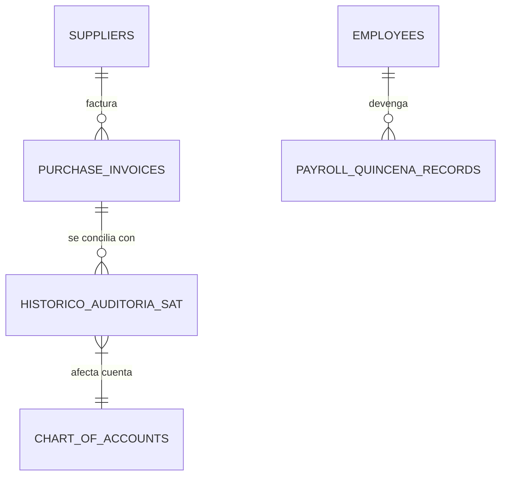

# Módulo: Contabilidad & SAT

## Descripción general
Este módulo gestiona la salud financiera y el cumplimiento fiscal del restaurante. Su objetivo principal es automatizar la conciliación de documentos tributarios electrónicos (DTE) mediante la sincronización directa con el portal de la SAT, administrar los egresos operativos y consolidar la información para libros contables y declaraciones de impuestos.

## Categorías
1. **Sincronización SAT**: Mapeo automático de Facturas de Ventas (Emitidas) y Gastos/Compras (Recibidas).
2. **Clasificación Contable**: Asignación de categorías de gasto (ej. Alquileres, Servicios, Mercadería) a cada factura recibida.
3. **Control de Egresos**: Registro de gastos menores (caja chica) y compras a proveedores.
4. **Planilla de Empleados**: Gestión de nómina, bonificaciones y deducciones de ley.
5. **Impuestos (IVA/ISR)**: Generación de reportes para declaración mensual.

## Interacción con Base de Datos

### Estructura de Tablas (DDL)

#### 1. `historico_auditoria_sat` (Maestro Fiscal)
Repositorio central de documentos tributarios.
- `id`: `UUID` (PK).
- `fel_uuid`: `TEXT` (Unique) - UUID de la SAT.
- `tipo`: `TEXT` ('emitida' | 'recibida').
- `monto_total`: `NUMERIC(14,2)`.
- `iva_monto`: `NUMERIC(14,2)`.
- `items`: `JSONB` - Detalle de productos extraídos del XML.
- `cuenta_contable`: `TEXT` - Mapeo al catálogo de cuentas.

#### 2. `purchase_invoices` (Cuentas por Pagar)
- `supplier_name`: `TEXT`.
- `invoice_number`: `TEXT`.
- `status`: `TEXT` ('pendiente' | 'pagada' | 'anulada').

#### 3. `payroll_quincena_records` (Planilla)
- `employee_id`: `UUID` (FK).
- `period_label`: `TEXT` (Ej. '2026-04').
- `quincena`: `INTEGER` (1 o 2).
- `total_neto`: `NUMERIC(14,2)`.

### Relaciones Lógicas


### Consultas de Operación
**Detección de Crédito Fiscal Pendiente:**
```sql
SELECT 
    sum(iva_amount) as total_iva_credito
FROM purchase_invoices
WHERE status = 'pendiente';
```

**Resumen de Gastos por Clasificación Contable:**
```sql
SELECT 
    clasificacion_compra, 
    sum(monto_total) as subtotal
FROM historico_auditoria_sat
WHERE tipo = 'recibida'
GROUP BY clasificacion_compra;
```
