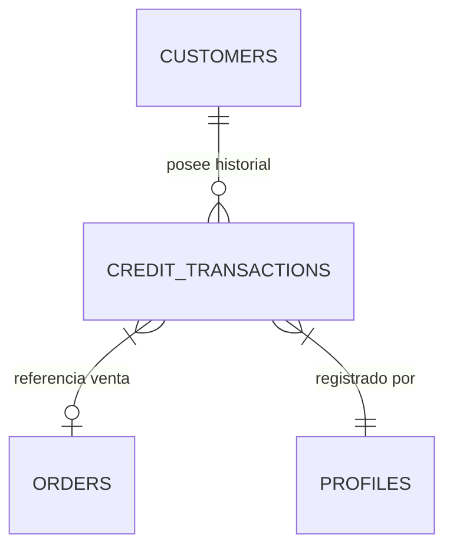

# Módulo: Cuentas por Cobrar

## Descripción general
El módulo de Cuentas por Cobrar gestiona las líneas de crédito otorgadas a clientes corporativos u hoteles. Su propósito es permitir el cierre de ventas "AL CRÉDITO" en el POS, manteniendo un seguimiento riguroso de los saldos pendientes, límites de crédito autorizados y la aplicación de abonos o pagos posteriores para la liberación de saldo.

## Categorías
1. **Cartera de Clientes**: Registro de entidades con crédito autorizado.
2. **Transacciones de Crédito**: Cargos automáticos generados desde el POS.
3. **Gestión de Abonos**: Registro manual de pagos de clientes para reducir su deuda.
4. **Estados de Cuenta**: Reportes históricos de compras y pagos por cliente.

## Interacción con Base de Datos

### Estructura de Tablas (DDL)

#### 1. `customers` (Maestro Crédito)
- `id`: `UUID` (PK).
- `name`: `TEXT`.
- `nit`: `TEXT` (Unique).
- `credit_limit`: `NUMERIC(14,2)` - Techo máximo de deuda permitido.
- `current_balance`: `NUMERIC(14,2)` - Deuda acumulada actual.
- `authorized_discount`: `NUMERIC` - % de descuento por fidelidad.

#### 2. `credit_transactions` (Libro Mayor de Crédito)
- `id`: `UUID` (PK).
- `customer_id`: `UUID` (FK) - Relacionado a `customers`.
- `order_id`: `UUID` (FK) - Relacionado a `orders` (opcional).
- `type`: `TEXT` ('CHARGE' | 'PAYMENT').
- `amount`: `NUMERIC(14,2)`.
- `created_by`: `UUID` (FK) - Relacionado a `profiles`.

#### 3. `receivables_summary` (Vista de Control)
- `customer_name`: `TEXT`.
- `saldo`: `NUMERIC`.
- `total_cargos`: `INTEGER`.
- `ultimo_pago`: `TIMESTAMP`.

### Relaciones Lógicas


### Lógica de Automatización (Triggers)
El sistema utiliza un **Trigger SQL** (`register_credit_sale`) que detecta cambios en la tabla `orders`:
1. **Condición**: Cuando `payment_method = 'AL CRÉDITO'` y `customer_id` no es nulo.
2. **Acción**: Inserta automáticamente un registro `CHARGE` en `credit_transactions` y suma el monto al `current_balance` del cliente.

**Ejemplo de Trigger (Procedimiento):**
```sql
CREATE OR REPLACE FUNCTION handle_credit_sale()
RETURNS TRIGGER AS $$
BEGIN
    IF (NEW.payment_method = 'AL CRÉDITO') THEN
        INSERT INTO credit_transactions (customer_id, order_id, amount, type)
        VALUES (NEW.customer_id, NEW.id, NEW.total, 'CHARGE');
        
        UPDATE customers SET current_balance = current_balance + NEW.total
        WHERE id = NEW.customer_id;
    END IF;
    RETURN NEW;
END;
$$ LANGUAGE plpgsql;
```
