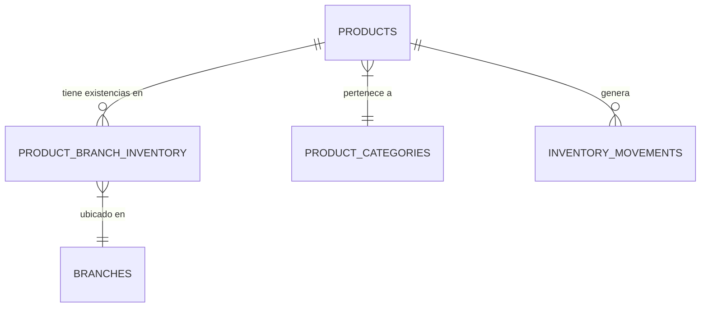

# Módulo: Inventarios

Este módulo se encarga de la gestión integral de los recursos físicos del restaurante, divididos en Insumos (materia prima, desechables) y Utensilios (vajilla, equipo).

## Categorías Principales

El inventario se organiza en dos grandes tipos:
1. **Insumos**: Productos consumibles.
   - Desechables
   - Empaque para llevar
   - Limpieza
   - Cocina consumibles
   - Oficina y POS
2. **Utensilios**: Bienes duraderos.
   - Vajilla y Cristalería
   - Cubiertos
   - Utensilios de cocina
   - Equipos menores
   - Almacenamiento

## Funcionamiento

### Gestión de Stock
- **Stock Actual**: Control en tiempo real de las existencias.
## Descripción general
El módulo de Inventarios es el núcleo del control de recursos del restaurante. Su propósito es centralizar la gestión de materias primas (insumos) y activos operativos (utensilios), asegurando que el flujo de existencias sea trazable desde la compra hasta el consumo final en recetas o desperdicio. Operativamente, permite el monitoreo de niveles críticos y la realización de auditorías físicas para prevenir mermas.

## Categorías
El módulo se divide en dos grandes dominios de datos:
1. **Insumos (Consumibles)**: Productos que forman parte de la transformación culinaria (ej. Harina, Carne, Vegetales).
2. **Utensilios (Activos)**: Elementos necesarios para la operación que no se consumen directamente (ej. Platos, Cubiertos, Cristalería).
3. **Kardex**: Registro histórico de movimientos (entradas, salidas, ajustes).
4. **Auditorías de Existencia**: Procesos de conteo físico vs. saldo en sistema.

## Interacción con Base de Datos

### Estructura de Tablas (DDL)

#### 1. `products` (Maestro de Inventario)
Es la tabla principal. Se identifica un ítem de inventario cuando `es_platillo = false`.
- `id`: `UUID` (PK) - Identificador único.
- `product_code`: `TEXT` (Unique) - Código SKU o barras.
- `name`: `TEXT` - Nombre descriptivo.
- `unit_measure`: `TEXT` - Unidad base (lb, kg, lt, unidad).
- `conversion_factor`: `NUMERIC` - Factor para recetas.
- `cost_price`: `NUMERIC(14,2)` - Costo de adquisición.
- `product_category_id`: `UUID` (FK) - Relación con `product_categories`.
- `supplier_id`: `UUID` (FK) - Proveedor preferente.

#### 2. `product_branch_inventory` (Saldos por Sucursal)
- `product_id`: `UUID` (FK) - Vinculado a `products`.
- `branch_id`: `UUID` (FK) - Vinculado a sucursal.
- `quantity`: `NUMERIC` - Stock físico actual.
- `min_stock`: `NUMERIC` - Punto de reorden.
- **PK Compuesta**: `(product_id, branch_id)`.

#### 3. `inventory_movements` (Kardex)
- `type`: `ENUM` ('ENTRY', 'EXIT', 'ADJUSTMENT').
- `quantity`: `NUMERIC` - Cantidad afectada.
- `reason`: `TEXT` - Justificación técnica.

### Relaciones Lógicas


### Consultas de Operación
**Cálculo de Valor de Inventario:**
```sql
SELECT 
    sum(i.quantity * p.cost_price) as valor_total
FROM product_branch_inventory i
JOIN products p ON i.product_id = p.id
WHERE p.es_platillo = false;
```

---
*Documentación Técnica - Restaurante Las Palmas*
