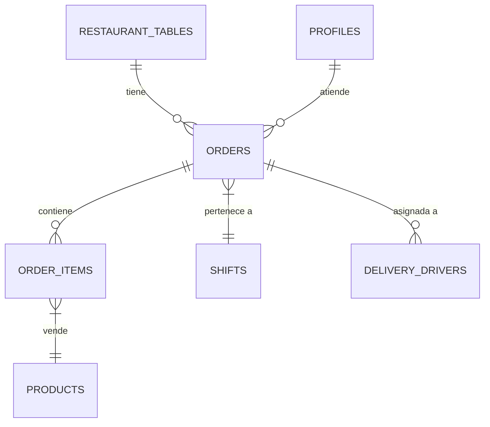

# Módulo: Ventas POS

## Descripción general
El módulo de Ventas (Punto de Venta) es el centro transaccional del restaurante. Su propósito es capturar las órdenes de los clientes de manera eficiente, coordinar la preparación con cocina (KDS) y gestionar el proceso de pago. Soporta múltiples modalidades de servicio (Mesa, Delivery, Para Llevar) y garantiza la integridad del flujo de dinero mediante arqueos de caja y turnos.

## Categorías
1. **Terminal de Ventas**: Interfaz táctil para la toma de pedidos rápida.
2. **Control de Mesas**: Mapa visual del restaurante para el seguimiento del consumo en salón.
3. **Delivery y Motoristas**: Gestión de pedidos a domicilio, asignación de pilotos y rastreo de estados de entrega.
4. **Cajas y Turnos**: Apertura, movimientos de efectivo y cierres (arqueos) de caja por usuario.
5. **Facturación**: Integración con el motor de emisión de facturas (DTE).

## Interacción con Base de Datos

### Estructura de Tablas (DDL)

#### 1. `orders` (Transacciones)
Cabecera de cada pedido realizado.
- `id`: `UUID` (PK).
- `status`: `ENUM` ('pending', 'preparing', 'ready', 'completed', 'cancelled').
- `total`: `NUMERIC(14,2)`.
- `payment_method`: `TEXT` ('cash', 'card', 'credit').
- `table_id`: `TEXT` (FK) - Relacionado a `restaurant_tables`.
- `waiter_id`: `UUID` (FK) - Relacionado a `profiles`.
- `is_paid`: `BOOLEAN` - Estado de liquidación.

#### 2. `order_items` (Detalle Comanda)
- `order_id`: `UUID` (FK).
- `product_id`: `UUID` (FK).
- `quantity`: `INTEGER`.
- `unit_price`: `NUMERIC(14,2)`.
- `notes`: `TEXT` - Instrucciones especiales para cocina.

#### 3. `shifts` (Control de Caja)
- `starting_balance`: `NUMERIC`.
- `cash_sales`: `NUMERIC`.
- `card_sales`: `NUMERIC`.
- `total_expected`: `NUMERIC` - Suma calculada por el sistema.

### Relaciones Lógicas


### Consultas de Operación
**Estado de Ventas del Día (Agrupado por Método de Pago):**
```sql
SELECT 
    payment_method, 
    count(*), 
    sum(total) 
FROM orders 
WHERE created_at::date = current_date 
AND status = 'completed'
GROUP BY payment_method;
```

**Monitor de Cocina (KDS) - Órdenes Pendientes:**
```sql
SELECT o.id, o.created_at, i.quantity, p.name 
FROM orders o
JOIN order_items i ON o.id = i.order_id
JOIN products p ON i.product_id = p.id
WHERE o.status = 'preparing'
ORDER BY o.created_at ASC;
```
